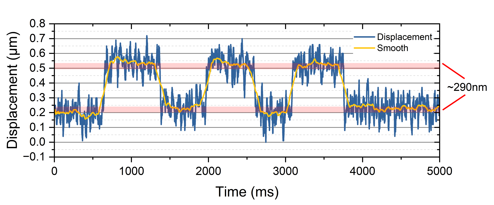
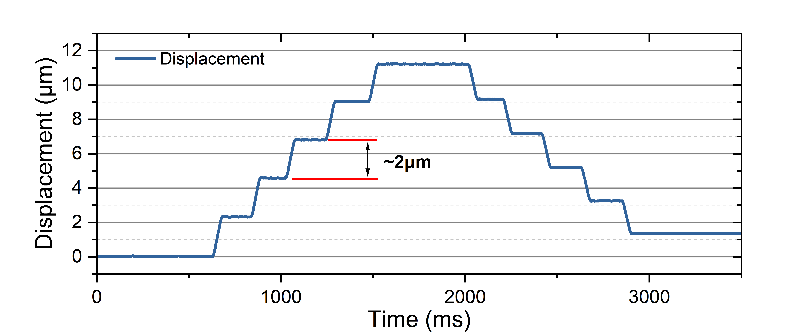
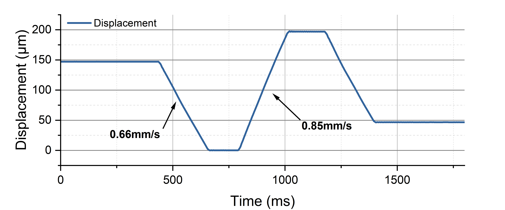
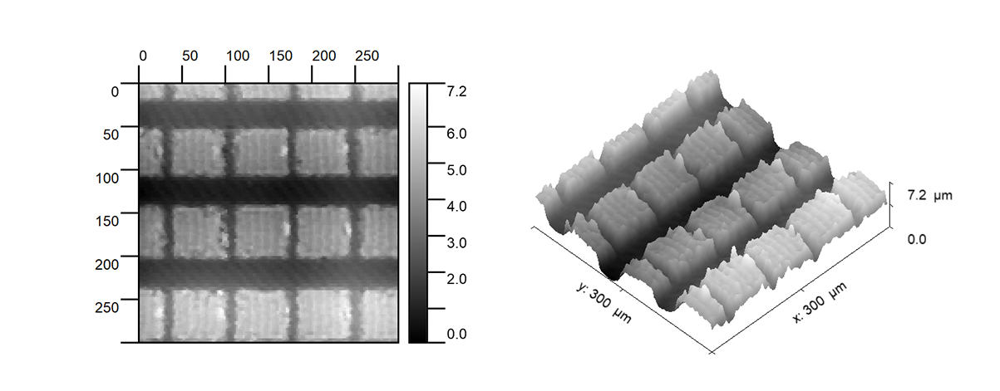
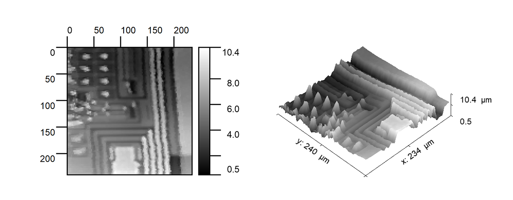
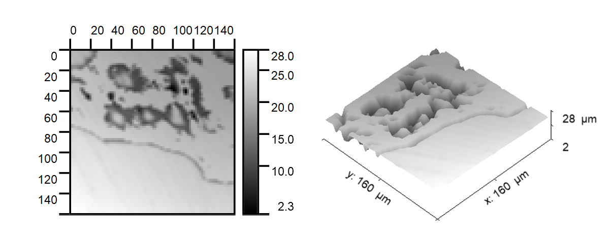
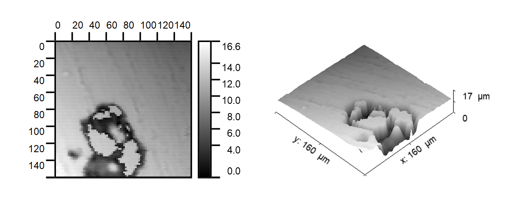
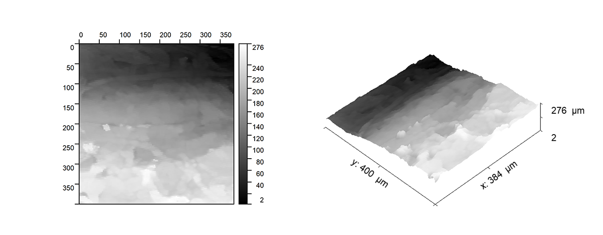

# Micro-Profilometer 微米级轮廓仪

## 项目简介

本项目主要设计了一个**亚微米级定位台**，通过与Micro-Epsilon共聚焦位移传感器进行结合后，设计成为微米级表面轮廓仪。
1、该轮廓仪能够完成对微小样品的表面轮廓测量（如晶圆裸片、金属表面等），分析其表面平整度或起伏结构。动态深度分辨率能够达到38nm，横纵分辨率能够达到8μm。
2、对于亚纳米级定位台，其分辨率能够达到100nm。基于该定位台，能够实现包括但不限于：扫描成像（如本项目所示的轮廓仪）、微流控操纵、光学对准等功能。

## 性能表现

### 亚微米级定位台

该定位台为基于粘-滑效应工作原理，具体分析可参考文章：

Open STM: A low-cost scanning tunneling microscope with a fast approach method

https://www.sciencedirect.com/science/article/pii/S2468067223001116

Low-cost, open-source XYZ nanopositioner for high-precision analytical applications

https://www.sciencedirect.com/science/article/pii/S2468067222000621

位移测试通过IFC2421共聚焦位移传感器与IFS2405-1探头完成，采样率为1ksps。

#### 最小步长（5V锯齿波）

在对压电陶瓷施加5Vp-p的锯齿波时，定位台所产生的位移为100nm左右。

#### 稳定步长（10V锯齿波）

在实际测试过程中，过低的锯齿波电压可能导致位移的不稳定。随着驱动电压的增加，定位台的位移将趋于稳定，以下是10V锯齿波驱动下的单步位移情况。（对于无需反向移动的情况，基于AL1.65型压电陶瓷的单步电压可增加至20Vp-p）

#### 稳定步长（10V锯齿波x10）

通过施加10个连续的10V锯齿波，可以实现2μm左右的单向稳定位移。

在下图所示的过程中，反向位移略小于正向位移，这可能是磁铁与滑轨产生了倾斜导致的。在部分的测试结果中，正向与方向位移能够接近。

#### 最高速度测试

通过改变锯齿波斜率，测试定位台能够达到的最高速度。如下图所示，定位台的最高速度能够大大0.85mm/s。

### 微米级轮廓仪

通过将定位台与共聚焦位移传感器结合，设计成为微米级轮廓仪。在工作过程中，定位台进行蛇形扫描，共聚焦传感器采集位移数据，经上位机整合后采集成图像。注意，以下图片的单位**均为微米**。

原始数据可以在ScanImages>RawImage中被找到。其中，xxxs.tiff为灰度映射至[0~255]的版本，以方便直接查看。原始图像需要使用Gwyddion或其他相关软件进行查看。

#### 晶圆裸片

#### 阳极氧化铝表面

#### 苹果表面

#### 纸张表面

#### 纸巾表面

## 文件目录介绍

3DModel > 包含了项目所有的3D文件

3DModel > CNC > 包含了项目需要加工的CNC文件

3DModel > SolidWorks > 包含了项目的3D原始工程文件

ControlSoftware > 包含了项目使用到的脚本，请安装requirements.txt对应的pip包后运行gui.py以启动上位机

ControlSoftware > reverse.py 用于高度反转

Images > 包含压电滑台的性能数据

Pico2Firmware > 树莓派Pico2固件

ScanImages > 轮廓仪的扫描原始结果

PCB > 工程的PCB文件，请使用EasyEDA/立创EDA打开

## 复刻步骤

### PCB复刻

按照PCB文件夹下提供的文件进行复刻即可。有以下注意事项：

- 对于+5V LDO、DAC3、ADC区域电路为非必要部分，如无需求，可不进行焊接。
- 对于DAC部分的电路，如果DAC采用AD5761R，则ADR421可不进行焊接。如果采用AD5761，则需要进行焊接。对于本项目，默认采用AD5761R。AD5761R与AD5761在寄存器操作时略有不同，后续将进行介绍。

### 固件烧录

请使用VS Code打开Pico2Firmware>Table_Movement进行烧录，或使用Pico2Firmware目录下的.uf2文件完成烧录。

如果需要修改AD5761/AD5761R的初始化设置，请修改Table_Movement>lib>ad57x1>ad57x1.cpp中的\#define CONTROL_REG_BASE，该宏定义对AD5761/AD5761R的初始化进行了设置，包括内部参考电压源的开启/关闭，详情请参考对于数据手册的CONTROL REGISTER小节。

### 零件组装

所有需要加工的文件被放置在了3DModel > CNC下，请参考视频[链接待更新]或3DModel > SolidWorks下的XYTable.SLDASM以及full_assemble.SLDASM进行组装。

- 对于需要额外购买的Z轴定位台，其关键词为[Z轴升降台]，台面尺寸为60x60cm，行程为1cm。

- 对于fix.STEP，可以采用3D打印。
- 定位台的组装可参考[OpenSTM项目](https://github.com/Dimsmary/OpenSTM)，或对应的HardwareX文章：https://doi.org/10.1016/j.ohx.2023.e00504。需要注意的是，在组装定位台时，需要将磁铁侧壁打磨光滑，否则定位台的行程可能受到影响。
- PCB中的Connector通过M2螺丝安装在XYTable_X中，G连接压电陶瓷的负极，X/Y连接压电陶瓷的正极。对于Y轴压电陶瓷的走线已预留槽位，可使用漆包线连接至此PCB。

## 使用方法

### 控制板设置与连接

#### 电源跳线设置

对于PCB电源跳线帽部分的连接，其顺序为（对于三脚，不连则为选择中间，连接中间与另外一端则为选择另外一端）：

SYNC/FREQ: 2.4M

SEQ: SEQ.

SLEW: NORM.

EN1:ON

EN2:OFF

SS: 连接

V_EN: 连接

COMP1: GND

COMP2: GND

#### 数据线连接

SYN1、SYN2连接至GPIO17、20，SDI2、SCK2连接至SPI0的数据输出、时钟引脚。

#### 电源连接

使用5V Type-C口电源连接至Power_IN端。

#### 与定位台的连接

使用SMA-IPEX连接线，将DAC0、DAC1与定位台中的Connector PCB连接。

### PC-USB连接

将PICO2连接至PC，此时PICO2将在PC处初始化两个虚拟串口。

使用RS422转USB连接Micro-Epsilon共聚焦位移传感器与PC，在Micro-Epsilon的设置中，需要设置仅输出Distance1。

### 上位机使用

运行gui.py启动上位机。

上位机包含四个选项卡：Serial Ports, DAC Manual Control, Sawtooth Control, Scan。

#### Serial Ports

在Serial Ports中，moving table port连接PICO2的虚拟串口，连接数字较大的一个。（如，PICO2提供了COM12和COM13，连接COM13）。confocal port连接RS422转USB。

#### DAC Manual Control

在DAC Manual Control中，可以对DAC0/1的输出电压控制。如果需要控制DAC3，可以将SYN3连接至GPIO21。

#### Sawtooth Control

在Sawtooth Control中，可以控制DAC0/1发送锯齿波。以下是参数解释：

Sawtooth Steps：锯齿波数量。

Increment：电压每步增量，单位：V。

Maximum Voltage：锯齿波电压峰值。

Bias Voltage：锯齿波初始电压。

Channel Select：输出端口选择，X channel则为DAC0，Y Channel则为DAC1。

在参数修改后，需要点击Sync Settings进行参数同步。

点击Send Positive Sawtooth则会发送正锯齿波，Send Negative Sawtooth则会发送负锯齿波。

#### Scan

在Scan中，可以对样品轮廓进行扫描。

X Forward Steps：扫描过程中，X定位台的单步前进的锯齿波数。

X Backward Steps：扫描过程中，X定位台的单步后退锯齿波数。

Y Forward Steps：扫描过程中，Y定位台的单步前进锯齿波数。

Y Backward Steps：暂时不使用

Image Size X：图像X尺寸

Image Size Y：图像Y尺寸

Increment：暂时不使用

点击Start Monitor后，共聚焦传感器的位移值将实时显示在图像框的上方。将各参数值设置好后，点击Scan开始扫描。

需要注意的是，考虑到定位台的正向位移和反向位移可能不一致，可以设置不同的X Forward/Backward Steps值。当你观察到图像不对劲时，可以尝试保持Forward值，然后增加或减少Backward值直到图像正常。

在完成扫描后，图像将被显示在图像框中，点击Save Image即可对图像进行保存。图像将被保存为两张，其中带_scaled后缀的图像的灰度值将被映射至0~255以便浏览。

## 最后

如果你有任何问题，欢迎提交Issue。
