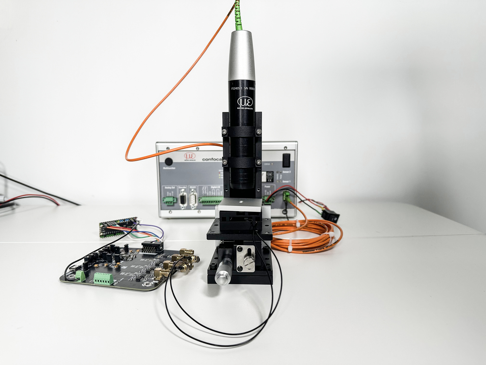
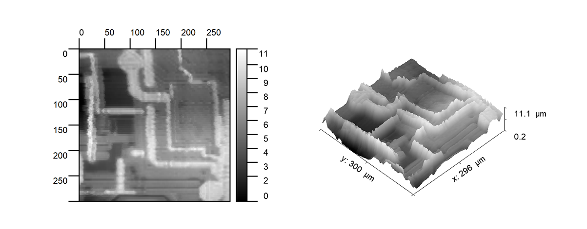

# Micro-Profilometer

**[中文](README.md) | [English](README_ENG.md)**

## Project Overview

This project primarily designs a **sub-micron positioning stage**. By integrating it with a Micro-Epsilon confocal displacement sensor, it is developed into a micron-level surface profilometer.

1. This profilometer can measure the surface profile of small samples (such as wafer dies, metal surfaces, etc.), analyzing their surface flatness or topographic features. It achieves a dynamic depth resolution of 38nm and lateral resolutions of 8μm.
2. For the sub-micron positioning stage, its resolution reaches 100nm. Based on this stage, various functions can be implemented, including but not limited to: scanning imaging (as demonstrated by this profilometer project), microfluidic manipulation, optical alignment, etc.

## Performance

### Sub-Micron Positioning Stage

This positioning stage operates based on the stick-slip principle. For detailed analysis, please refer to the articles:

Open STM: A low-cost scanning tunneling microscope with a fast approach method

https://www.sciencedirect.com/science/article/pii/S2468067223001116

Low-cost, open-source XYZ nanopositioner for high-precision analytical applications

https://www.sciencedirect.com/science/article/pii/S2468067222000621

Displacement testing was completed using an IFC2421 confocal displacement sensor with an IFS2405-1 probe, at a sampling rate of 1 ksps.

#### Minimum Step (5V Sawtooth Wave)

When a 5Vp-p sawtooth wave is applied to the piezoelectric ceramic, the displacement generated by the positioning stage is about 100nm.

#### Stable Step (10V Sawtooth Wave)

During practical testing, excessively low sawtooth wave voltage may lead to unstable displacement. As the driving voltage increases, the stage's displacement becomes more stable. The following shows the single-step displacement under a 10V sawtooth wave drive. (For scenarios not requiring reverse movement, the single-step voltage for the AL1.65 type piezoelectric ceramic can be increased up to 20Vp-p).

#### Stable Steps (10V Sawtooth Wave x10)

By applying 10 consecutive 10V sawtooth waves, a unidirectional stable displacement of about 2μm can be achieved.

In the process shown below, the reverse displacement is slightly less than the forward displacement, which might be caused by tilting between the magnet and the slide rail. In some test results, the forward and reverse displacements can be close.

#### Maximum Speed Test

By changing the slope of the sawtooth wave, the maximum speed achievable by the positioning stage was tested. As shown below, the maximum speed of the stage can reach 0.85 mm/s.

### Micron-Level Profilometer

By integrating the positioning stage with the confocal displacement sensor, a micron-level profilometer is constructed. During operation, the positioning stage performs a raster scan, the confocal sensor collects displacement data, and the host computer integrates this data to form an image. Note that the units in the following images are **all in micrometers**.

Raw data can be found in `ScanImages > RawImage`. Among them, files with the `xxxs.tiff` suffix are versions with grayscale mapped to [0~255] for direct viewing. The original images need to be viewed using Gwyddion or other relevant software.

#### Wafer Die

#### Anodized Aluminum Surface

#### Apple Surface

#### Paper Surface

#### Tissue Paper Surface

## Directory Structure

`3DModel` > Contains all 3D files for the project

`3DModel > CNC` > Contains CNC files required for project fabrication

`3DModel > SolidWorks` > Contains the original 3D engineering files for the project

`ControlSoftware` > Contains scripts used in the project. Please install the pip packages listed in `requirements.txt` and run `gui.py` to start the host computer software.

`ControlSoftware > reverse.py` > Used for height inversion.

`Images` > Contains performance data for the piezoelectric stage.

`Pico2Firmware` > Raspberry Pi Pico 2 firmware.

`ScanImages` > Raw scanning results from the profilometer.

`PCB` > PCB files for the project. Please open using EasyEDA/JiLiang EDA. Or open online:https://oshwhub.com/dimsmary/micron-profilometer-micro-profil

## Replication Steps

### PCB Replication

- Replicate according to the files provided in the PCB folder. Note the following:
  - The circuits for the +5V LDO, DAC3, and ADC areas are non-essential and can be left unsoldered if not required.
  - For the DAC section circuit: If using the AD5761R DAC, the ADR421 does not need to be soldered. If using the AD5761, it must be soldered. This project defaults to using the AD5761R. Note that register operations for the AD5761R and AD5761 differ slightly; this will be explained later.

### Firmware Flashing

Please use VS Code to open `Pico2Firmware > Table_Movement` for flashing, or use the `.uf2` file in the `Pico2Firmware` directory to flash.

If you need to modify the AD5761/AD5761R initialization settings, please modify the `#define CONTROL_REG_BASE` in `Table_Movement > lib > ad57x1 > ad57x1.cpp`. This macro definition sets the initialization for the AD5761/AD5761R, including enabling/disabling the internal reference voltage source. Please refer to the CONTROL REGISTER section of the respective datasheet for details.

### Parts Assembly

- All files requiring machining are located in `3DModel > CNC`. Please refer to the video [Link to be updated] or the `XYTable.SLDASM` and `full_assemble.SLDASM` files under `3DModel > SolidWorks` for assembly.
  - For the additionally purchasable Z-axis stage, search using the keyword `[Z-axis lifting stage]`, with a platform size of 60x60mm and a travel of 1cm.
  - For `fix.STEP`, 3D printing can be used.
  - The assembly of the positioning stage can refer to the [OpenSTM project](https://github.com/Dimsmary/OpenSTM), or the corresponding HardwareX article: https://doi.org/10.1016/j.ohx.2023.e00504. Note that when assembling the positioning stage, the sidewalls of the magnets need to be polished smooth, otherwise the travel range of the stage might be affected.
  - The Connector on the PCB is mounted on the `XYTable_X` using M2 screws. `G` connects to the negative terminal of the piezoelectric ceramic, `X`/`Y` connect to the positive terminals of the piezoelectric ceramics. A slot is reserved for the wiring of the Y-axis piezoelectric ceramic; use enameled wire to connect it to this PCB.

## Usage Instructions

### Control Board Setup and Connection

#### Power Jumper Settings

For the PCB power jumper cap connections, the order is as follows (for three-pin headers, not connecting means selecting the middle pin; connecting the middle and another pin selects that other pin):

- SYNC/FREQ: 2.4M
- SEQ: SEQ.
- SLEW: NORM.
- EN1: ON
- EN2: OFF
- SS: Connect
- V_EN: Connect
- COMP1: GND
- COMP2: GND

#### Data Cable Connection

Connect SYN1, SYN2 to GPIO17, GPIO20. Connect SDI2, SCK2 to the data output and clock pins of SPI0.

#### Power Connection

Use a 5V Type-C power supply connected to the `Power_IN` terminal.

#### Connection to the Positioning Stage

Use SMA-to-IPEX cables to connect DAC0, DAC1 to the Connector PCB on the positioning stage.

#### PC-USB Connection

Connect the PICO2 to the PC. The PICO2 will initialize two virtual COM ports on the PC.

Connect the Micro-Epsilon confocal displacement sensor to the PC using an RS422-to-USB converter. In the Micro-Epsilon settings, configure it to output only `Distance1`.

### Host Computer Software Usage

Run `gui.py` to start the host computer software.

The software interface contains four tabs: `Serial Ports`, `DAC Manual Control`, `Sawtooth Control`, `Scan`.

#### Serial Ports

In the `Serial Ports` tab, connect `moving table port` to the virtual COM port of the PICO2 (connect to the higher numbered port, e.g., if PICO2 provides COM12 and COM13, connect to COM13). Connect `confocal port` to the RS422-to-USB converter.

#### DAC Manual Control

In the `DAC Manual Control` tab, you can manually control the output voltage of DAC0/1. If you need to control DAC3, connect SYN3 to GPIO21.

#### Sawtooth Control

In the `Sawtooth Control` tab, you can control DAC0/1 to send sawtooth waves. Parameter explanations:

- `Sawtooth Steps`: Number of sawtooth waves.
- `Increment`: Voltage increment per step, unit: V.
- `Maximum Voltage`: Peak voltage of the sawtooth wave.
- `Bias Voltage`: Initial voltage of the sawtooth wave.
- `Channel Select`: Output port selection, `X channel` is DAC0, `Y Channel` is DAC1.

After modifying parameters, click `Sync Settings` to synchronize the parameters.

Click `Send Positive Sawtooth` to send a positive sawtooth wave, and `Send Negative Sawtooth` to send a negative sawtooth wave.

#### Scan

In the `Scan` tab, you can perform a raster scan of the sample surface.

- `X Forward Steps`: Number of sawtooth waves for the single-step forward movement of the X stage during scanning.
- `X Backward Steps`: Number of sawtooth waves for the single-step backward movement of the X stage during scanning.
- `Y Forward Steps`: Number of sawtooth waves for the single-step forward movement of the Y stage during scanning.
- `Y Backward Steps`: Not currently used.
- `Image Size X`: Image size in the X dimension.
- `Image Size Y`: Image size in the Y dimension.
- `Increment`: Not currently used.

Click `Start Monitor` to display the real-time displacement value from the confocal sensor above the image box. After setting all parameter values, click `Scan` to start the scan.

Note: Considering that the forward and reverse displacements of the positioning stage might not be equal, you can set different values for `X Forward Steps` and `X Backward Steps`. If you observe that the image looks distorted, try keeping the `Forward` value and then increasing or decreasing the `Backward` value until the image appears normal.

After the scan is complete, the image will be displayed in the image box. Click `Save Image` to save the image. Two images will be saved; the one with the `_scaled` suffix has its grayscale values mapped to 0~255 for easier viewing.

## Finally

If you have any questions, please feel free to submit an Issue.
